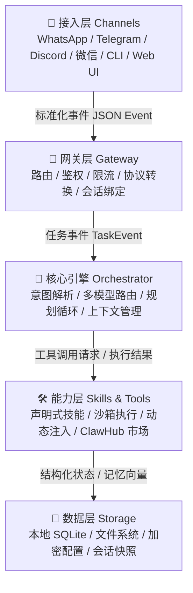
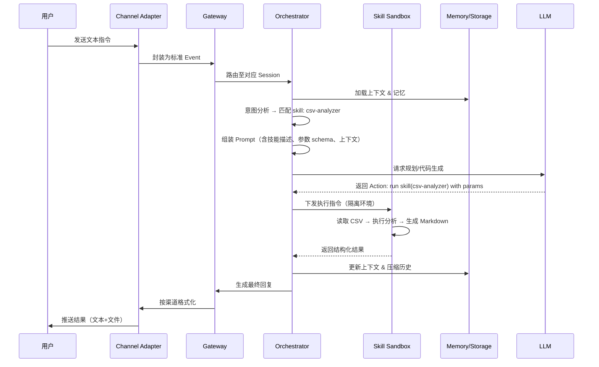

## OpenClaw到底是什么
OpenClaw是一个个人AI助手平台，可以跑在自己的设备里，比如：笔记本电脑，云服务器，Mac Mini，或者一个云容器。通过Gateway，连接即使通讯平台与本地AI Agent，它不仅是一个简单的消息转发器，而是一个具备完整会话管理、并发控制、记忆检索以及丰富工具支持的复杂Agent运行时环境。

OpenClaw把AI助手当作基础设施来构建，而不只是优化提示词。

## OpenClaw架构：分层和模块化设计
OpenClaw采用典型的**事件驱动 + 插件化**架构，整体可分为五层：


### 架构设计原则
| 原则 | 体现 |
|------|------|
| 🔒 本地优先 (Local-First) | 默认不依赖任何云服务，配置、记忆、日志全落盘本地 |
| 🔌 插件化 (Plugin-Driven) | 渠道、模型、技能、内存后端均通过接口抽象，可热插拔 |
| 🧠 认知-执行解耦 | LLM 仅负责“规划与决策”，实际 I/O 由沙箱隔离执行 |
| 🔄 状态可恢复 | 每次会话生成 Trace ID，支持中断续跑与上下文回放 |

## 二、核心组件拆解

### 2.1 接入层：多协议统一抽象
OpenClaw将不同IM平台的差异抹平统一的事件格式：
```json
{
  "channel": "telegram",
  "session_id": "usr_8f3a...9c2b",
  "message": { "type": "text", "content": "把 /tmp/report.pdf 转成 Markdown 并发给我" },
  "metadata": { "user_id": "123456", "timestamp": 1712345678 }
}
```
- 支持**双向适配**：不仅接收指令，还能通过同一通道推送文件、卡片、进度条。
- 安全机制：渠道级 Token 隔离、IP 白名单、消息体签名校验。

### 2.2 核心引擎：Orchestrator（调度大脑）

引擎是 OpenClaw 的“中枢神经”，负责：

- **意图路由**：判断是否需要调用技能、是否可直接回复
- **多模型策略**：按任务复杂度动态选择模型（例：简单问答 → `gpt-4o-mini`，复杂规划 → `claude-3.5-sonnet`）
- **规划循环**：采用 `ReAct` 或 `Plan-and-Execute` 范式，支持 `max_iterations` 限制防死循环
- **上下文管理**：滑动窗口 + 语义摘要 + 关键实体保留

### 2.3 技能系统（Skills）：标准化能力单元

每个 Skill 是一个独立模块，包含：

```yaml
# skills/file_converter/skill.yaml
name: file-converter
description: 将 PDF/Word/Excel 转换为 Markdown 或纯文本
trigger:
  keywords: ["转换", "转成", "extract", "convert"]
  mime_types: ["application/pdf", "application/vnd.ms-excel"]
permissions:
  read: ["/tmp/", "~/Documents/"]
  write: ["/tmp/openclaw/output/"]
  network: false
entrypoint: "run.py"
timeout: 30s
```

- **动态注入**：引擎根据意图匹配 Skills，将其描述与参数 schema 注入 LLM Prompt
- **隔离执行**：默认运行在 `nsjail` / `Docker` / `WebAssembly` 沙箱中
- **自动注册**：放置到 `~/.openclaw/skills/` 即可被引擎发现

### 2.4 数据层：本地记忆与状态持久化

- **会话状态**：SQLite 存储 `session_id → context_vector` 映射
- **长期记忆**：本地轻量向量库（如 `SQLite-Vec` 或 `LanceDB`）+ 文本全文检索
- **配置加密**：敏感字段（API Key、Webhook Secret）使用 `libsodium` 本地加密
- **快照机制**：关键节点自动保存 `context_snapshot.json`，支持回滚

## 三、运行机制：一次指令的完整生命周期
以用户发送 `“分析 ~/data/sales.csv 并生成周报”` 为例：


### 关键机制说明
| 环节 | 技术实现 |
|------|----------|
| **上下文压缩** | 滑动窗口保留最近 N 轮；超出阈值时调用轻量模型生成摘要；关键实体（文件名、ID、约束条件）强制保留 |
| **错误恢复** | 技能执行失败 → 返回错误码 → Orchestrator 触发重试或降级策略（如换模型、简化指令） |
| **并发控制** | 基于 `asyncio` / `tokio` 事件循环，每个 Session 独立协程/线程，避免状态污染 |
| **审计追踪** | 每次调用生成 `trace_id`，记录 `prompt → tool_call → result → compression` 全链路 |

## 四、关键技术设计亮点
### 4.1 本地优先的隐私边界

- **零默认外发**：所有模型调用需显式配置 API Endpoint，支持本地 Ollama/vLLM
- **数据不出域**：文件操作、浏览器控制、终端执行均在宿主机或容器内完成
- **权限最小化**：技能声明需明确读写路径、网络开关、进程权限，引擎强制校验

### 4.2 动态技能注入与 AI 自发现

OpenClaw 不硬编码工具列表，而是：

1. 扫描 `skills/` 目录加载 YAML 描述
2. 将技能 `description + input_schema + examples` 转为工具调用格式
3. LLM 在生成阶段自主选择是否调用、如何传参
4. 支持 `clawhub` 市场一键拉取社区技能

### 4.3 安全沙箱与防注入设计

| 威胁类型 | 防御策略 |
|----------|----------|
| 提示词注入 (Prompt Injection) | 指令与数据分离渲染；用户输入经过 `<user_input>` 标签隔离；关键操作需二次确认 |
| 越权执行 | 技能权限白名单；文件系统路径正则校验；禁止 `sudo`/`rm -rf` 等危险模式匹配 |
| 网络外泄 | 默认禁用技能网络访问；需显式声明 `network: true` 且受主机防火墙策略约束 |
| 资源耗尽 | 技能超时控制、内存限制、迭代次数上限、异步队列背压 |

### 4.4 多模型智能路由

```yaml
# routing.yaml
models:
  light: "gpt-4o-mini"
  standard: "claude-3-5-haiku"
  heavy: "gemini-2.0-pro"
rules:
  - if: "intent == 'simple_qa' && tokens < 2k"
    use: light
  - if: "requires_file_ops or complex_planning"
    use: standard
  - if: "code_generation or multi_step_debug"
    use: heavy
  fallback: standard
```

引擎根据任务特征、上下文长度、历史成功率动态切换模型，兼顾成本与质量。

## 五、局限性与演进方向

### 当前边界

| 维度 | 现状 |
|------|------|
| 多设备同步 | 尚无官方云同步方案，依赖手动备份或第三方同步工具 |
| 复杂任务稳定性 | 长链路任务受 LLM 一致性影响，偶发步骤跳跃或参数错位 |
| 生态成熟度 | ClawHub 技能数量仍在增长，企业级合规（SOC2/GDPR）待完善 |
| 性能开销 | 沙箱隔离带来 ~15-30% 执行延迟，高频场景需优化 |

### 社区路线图（2026-2027）

-  **多智能体协作**：支持 `Agent Swarm` 模式，分工执行复杂工作流
-  **细粒度权限引擎**：基于 OPA/Rego 的动态策略评估
-  **本地微调接入**：无缝对接 LoRA/QLoRA 轻量模型，实现个性化记忆
-  **企业审计套件**：全量操作日志、合规导出、审批流集成


## OpenClaw VS Ai Agent

**一句话总结：** AI Agent是“自动驾驶”这个概念，OpenClaw是“特斯拉FSD套件” ——一个是范式，一个是实现。

###  本质区别

| 维度 | AI Agent | OpenClaw |
|------|----------|----------|
| **定位** | 一类 AI 系统的**设计范式**（理论） | 一个开源的**具体实现**（工程） |
| **类比** | "自动驾驶"这个想法 | 特斯拉 FSD 套件 |
| **约束** | 无技术栈限制 | Node.js + 本地优先 + 沙箱隔离 |

###  能力映射：理论 → 实践

```
AI Agent 通用能力          OpenClaw 对应实现
──────────────────────────────────────────
🔍 感知意图     →    Channel Adapter + 意图路由
🧭 任务规划     →    Orchestrator + 多模型策略  
🛠️ 工具调用     →    Skills 系统 + 沙箱执行
🧠 记忆管理     →    SQLite + 向量检索 + 上下文压缩
🔁 反思优化     →    Trace 回放 + 错误恢复机制
```
###  关键差异（选框架时看这里）

```yaml
# 部署模式
通用 Agent 框架: 云端优先，依赖服务商
OpenClaw:        本地优先，数据自己掌控

# 安全边界  
通用 Agent 框架: 理论上无限，靠开发者自觉
OpenClaw:        默认沙箱 + 权限声明 + 审计日志

# 扩展方式
通用 Agent 框架: 写代码注册工具/模型/记忆
OpenClaw:        改 YAML + 放文件，热加载生效
```

###  一句话选型建议

-  做研究/快速原型 → 用 **LangChain / AutoGen**（灵活）
-  要隐私/个人助理 → 用 **OpenClaw**（可控）
-  企业级复杂业务 → **自研或混合架构**（定制）


###  补充：它们不是对立关系

```
你可以：
1. 用 LangChain 写一个数据分析 Skill
2. 打包成 OpenClaw 的插件
3. 在本地安全执行

→ 研究灵活性 + 工程可控性，我都要 🦞
```

>  **小结**：先理解 Agent 范式（知道"做什么"），再用 OpenClaw 落地（解决"怎么做稳"）。